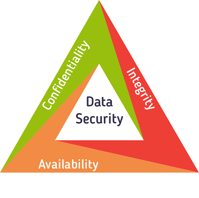
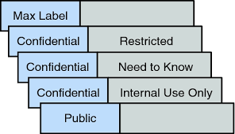
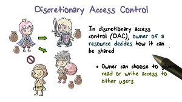
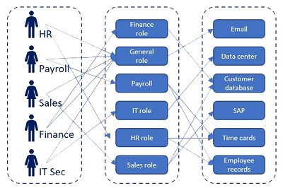
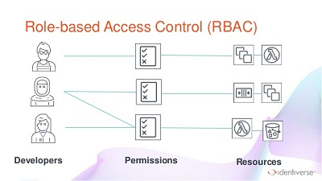
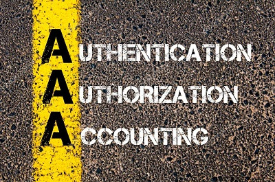
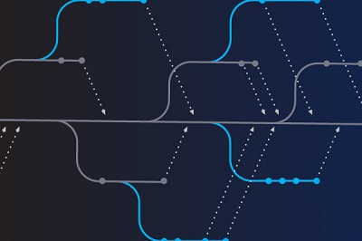
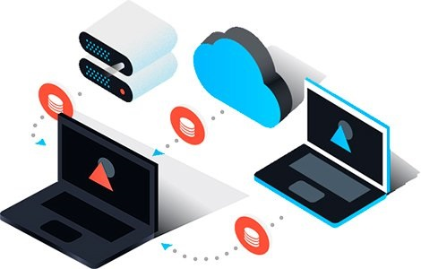
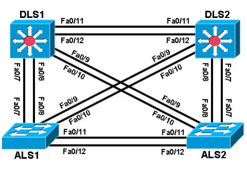

#CIA Triad#

---

>In deze document gaan we een belangrijke onderwerp bespreken namelijk de CIA triad. Dit is een security model dat bestaat uit drie elementen. **Confidentiality, integrity** en **availability.** Deze drie elementen worden gezien als de fundamentele elementen in data Security. We gaan elke element bespreken en daarna kijken we hoe we die elementen kunnen toepassen in een netwerk als oplossing. Na deze onderzoek heb ik een lijst eventuele oplossing voor elke aspect, uit die lijst moet er een paar uit gehaald worden en in onze netwerk toepassen.

---

##Explaining the triangle##

###1. Confidentality ###
>Confidentiality is een security principe die de toegang tot een bepaalde informatie beheerst. Toegang van informatie moet beperkt zijn tot alleen mensen die rechten hebben tot die informatie. Informatie moet verdeeld worden in verschillende categorieën, hoe hoger de categorie, hoe gevoeliger de data is. Gevoeligere informatie zal alleen toegankelijk zijn voor rechthebbende. Voordat we in systeem gaan werken voor de beveiliging moeten ook leren aan werknemers met gevoelige informatie, hoe ze die informaties moeten beschermen.

####Improve Comfidentiality ####

#####Passwords #####
>We beginnen bij de meeste eenvoudige. Mensen moeten geen gevoelige informatie zoals wachtwoorden etc. weggooien in de prullenbak. Beste Manniën is het eerst nat te maken door te kauwen zodat te tekst niet meer leesbaar is en dan weg te gooien of door spoelen.
>
>
>

>Gekozen wachtwoorden moeten een voldoen een bepaalde checklist, min karakter,1 hoofdletter,kleiletters, een speciale teken, geen naam of woord die gevonden kan worden in het woordenboek . Laat gebruikers hun wachtwoorden na een afgesproken **Maximum Password Age** hun wachtwoord veranderen. 
>
>

#####IPsec#####
>Een VPN(Vertual Private Network) is een privé network die gemaakt is in een publieke netwerk. Een VPN verbindt twee endpoints met elkaar. Een bedrijf kan zijn hoofdkantoor verbinden met een offsite werkruimte. Een VPN is privé netwerk omdat de informatie die hij vervoert geëncrypteerd is. er is **Confidentiality** verwezenlijkt wanneer de informatie in de VPN verkeer goed geëncrypteerd is, dit kan gedaan worden door IPsec. IPsec zorgt voor authentication, access control, integrity en confidentiality. De informatie kan geëncrypteerd en gecontroleerd worden. IPsec kan zowel gebruikt worden in **remote-access** als **site-to-site** VPN.
>
>

#####Access control models#####
>Access control models maakt het gemakkelijker voor bedrijven om toegang tot sommige informaties te verbieden of beperken voor sommige werknemers. Werknemers moeten alleen toegang hebben tot informatie die relevant is voor hun functies etc. er zijn vier soorten Access control models.

######Mandatory Access Control (MAC)######
>MAC Model is gecreëerd do defensie en de overheid en is daardoor een heel strikte Acces controle model. Toegang van alle data in het systeem op voorhand gedefinieerd door de administrator en wordt gecontroleerd door de OS. Mac gebruikt twee concepten. Ten eerste word alle data verdeeld in een graad van belangrijkheid, ten tweede is de gebruikers categorie. Hierdoor kunnen er regels geschreven worden die van toepassing zullen zijn voor een hele groep van gebruikers. Wanneer een gebruiker toegang wilt, kijkt de OS naar zijn gebruikers categorie en vergelijkt hij het met de lijst van soorten gebruikers die toegang hebben.
>
>Hoewel dit een heel veilige model is, is het redelijk vaag. Het kan geïmplementeerd worden op verschillende manieren. Het cost veel tijd en geld om alle categorieën en regels te beheren bij elke verandering in de infrastructuur, werknemers etc. Hierdoor wordt MAC nooit alleen gebruikt, maar altijd in combinatie met een andere model. 
>
>

######Discretionary Access Control######
>Hier is het geen OS die de regels toekent maar de gebruikers zelf. Een gebruiker gefineerd welke gebruiker welke rechten heeft tot zijn/of haar gegevens of documenten. Hier kan een gebruiker alleen rechten toekennen aan zijn/of haar eigen informaties, dus kan geen verandering aanbrengen in documenten van andere gebruikers. Er zijn voorgedefinieerde ACL's. Elke ACL heeft een lijst met gebruikers of groepen en hun toegangsniveaus, dus *read-only*, *read and write* of *full access.* Dit is flexibeler dan MAC maar wanneer een fout maakt een iemand toegang geeft aan een document waar hij geen recht op heeft kan het een probleem veroorzaken
>
>

######Role-Based Access Control######
>RBAC(A.K.A *non-Discretionary Access Control*) is een access controle type waarbij bedrijven toegang geven aan gebruiker gebaseerd op hun werk functies. Permissies worden toegewezen aan rollen binnen het bedrijf. Boekhouders hebben toegang tot financiële informaties en programmeurs hebben toegang tot folders of documentaties over het ontwikkelen van applicaties. Het is mogelijk om aangepaste regels te maken voor specifieke opdrachten. Maar ook beperkingen te zetten op specifieke rollen om geen toegang te hebben tot een specifieke taak of deel taak.
>
>

######Attribute-Based Access Control######
>Dit is een soort van RBAC, maar dit model gebruik speciale regels om toegang geven aan gebruiker. deze regels combineren verschillende attributen voor gebruiker, middelen en objecten. Hier wordt er geen beslissingen genomen op basis van rol, maar op basis van verschillende condities die in orde moeten zijn. ABAC gebruikt een logische **IF, THEN** statement om te zien of een gebruiker toegang moet krijgen of niet.
>
>
>

#####Authentication, Authorization, Accounting#####
>AAA is een tool die gebruikt wordt om gebruikers toegang te geven met *authentication*. Gebruiker kan inlopen in het systeem door gebruik te maken van gebruikersnaam en wachtwoord. administrator kan gebruiker toevoegen en deleten en zo toegang geven tot data of de tegengesteld. administrator kan het instellen om de authenticatie lokaal of via de server te laten gebeuren.
>
>Wat ze erop mogen doen, welke rechten ze hebben via *authorization*. De administrator geeft specifieke rechten aan gebruikers en die rechten bepalen welke info de gebruiker kan zien en welke configuraties hij mag doen.
>
>Bijhouden van acties die uitgevoerd werden door *accounting*. hierdoor wordt gegevens gemonitord en bijgehouden terwijl de gebruiker bezig is.
>
>

###2. Integrity ###
>Integrity is het behouden van consistente, nauwkeurige en betrouwbare data. Er moet maatregelen zijn om onrechtmatig personen geen toegang hebben en dat de date niet veranderd kan worden in transit. Sommige maatregelen kunnen *file permissies* of access controls, dit hebben we all in de vorige deel besproken.

#####Version Controle#####
>Version Controle is een systeem die je gebruikt om up-to-date te zijn met je projecten en een productie omgeving. VCS geeft ook de mogelijkheid om samen te werken met andere mensen rond een project. Via branches is het mogelijk om op een sub-project van de Main project te werken waardoor de Main project nooit beschadigt, en zodra de sub-project in orde is kan het gemengd met het hoofdproject. Bij beschadiging van data kan het project terug gedraaid worden naar vorige versie.
>
>

#####cryptographic Hash#####
>Hasing is een wiskundige functie gemakkijk is te doen maar het revers engineering hiervan is moeilijk. hasing wordt gebruikt om de integriteit van data te controleren en verzekeren. De functie neemt een variabele of volledige bericht genaamd *message* en creëer a tekst genaamd *HASH, message digest, digest, of digital fingerprint*. Het is onmogelijk dat twee verschillende sets data hetzelfde hash output hebben. zodra er iets aan het document veranderd zal er een andere hash uit komen. Omdat er geen twee data met hetzelfde hash kan zijn, wordt dit gebruikt om duplicatie en veranderingen op te sporen.
>
>

#####Host-Based Intrusion Detection#####
>*Intrusion Detection System* is een software of hardware die het netwerk monitort en een alerts naar de administrator stuurt wanneer het een malicieus opmerkt. Een *host-based Intrusion Detection Dystem* is om hosts te beschermen tegen malware. HIDS doen aan monitoring en sturen een report van hun bevindingen. hij kan *log analysis, event correlation, integrity checking, policy enforcement, rootkit detection*, en * alerting*. HIDS hebben een *file integrity checkig* of * data integrity monitoring*. 
HIDS weerhouden gevonden malware te uit te voeren, mocht het een host bereiken. Hierdoor zorgt HIDS ervoor dat heel data in netwerk hun integriteit behouden.
>
>

#####Back-ups#####
>Het is belangrijk dat we een of meerder back-ups hebben van de data. als er voor een of andere reden het hoofd database of er een probleem is het netwerk, moet er een back-up aanwezig zijn. Er moet zowel een lokaal back-up zijn, als een op de server. back-up op de server zal het gemakkelijk maken om alle data te synchroniseren en te bijwerken. de back-up lokaal kan gebruikt worden als er gen connectie is met de server, of wanneer het juist de server is die en probleem heeft.
>
>

###3. Availability ###
>Gebruikers kunnen zonder onderbreking gegevens kunnen raadplegen. Connectie moet niet uitvallen wanneer een gebruiker bezig is.

#####Hardware and software#####
>Continue beschikbaarheid in jou netwerk kan alleen gegarandeerd worden wanneer er een continue hardware en software onderhoud is. Hardware reparaties direct uitvoeren Wanneer er schade is. Zelfs beschadigde kabels kunnen voor problemen zorgen. Zorg ervoor dat de hardware op een goeie plaats is die voor langdurige productiviteit zal promoten. Dus laat je hardware toestellen niet reeksstreeks in de zon, of zet het niet in een ruimte waar er geen verluchting is etc. Er moet genoeg bandwijdte zijn voor communicatie en probeer bottlenecks te voorkomen.

>
>Zorg ook dat de software kant in orde is. Wees altijd up-to-date met de laatste update, want die kan performantie belemmeren. Wanneer er geen updates gebeuren dan kan je systeem zijn database ook niet bijwerken, waardoor hij een malicieuze programma zal binnen laten.

#####redundancy#####
Redundancy in de netwerk gaat ervoor zorgen dat de *availability* naar boven gaat. Wanneer er meerder links tussen netwerkt toestellen zijn, is er een redundante weg. 

######STP######
>STP zorgt er voordat er maar een weg genomen zal worden en zet de andere on stand bij zodra er een probleem is met de hoofdweg dan neemt de redundante weg het over. STP voorkomt loops wat ervoor kan zorgen dat het netwerk verkeer langzamer is of zelf volledig stopt en zorgt er ook voor dat er een redundante weg is waardoor jou netwerk kan blijven werken.
>
>

######EtherChannel######
>EtherChannel is wanneer je een link creëer door meer poorten met elkaar te groeperen. Bij EtherChannel gaan we meerdere interfaces met elkaar verbinden en een logische interface van maken. Hierdoor is er load balance. Als ik een link met vier poorten gemaakt heb , wordt de informatie stroom verdeeld door die vier kabels. Waardoor mijn verkeer sneller zal zijn, want poort is minder belast. Als er een probleem met een van de kabels is, zal de communicatie normaal veder gaan met de overgebleven kabels. Het is mogelijk om tot 8 kabels in een channel zijn.
>
>

